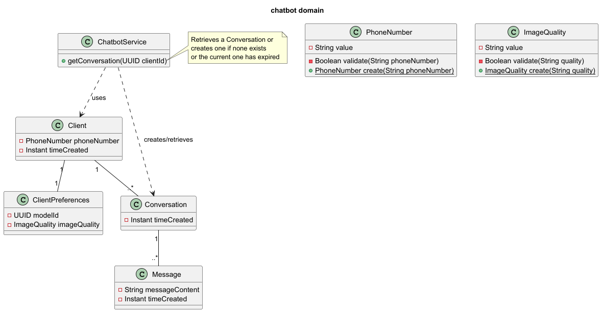
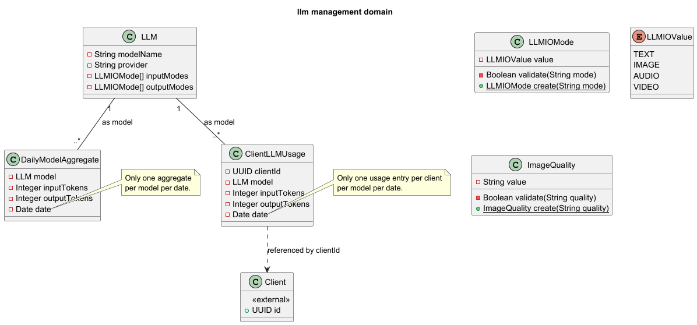
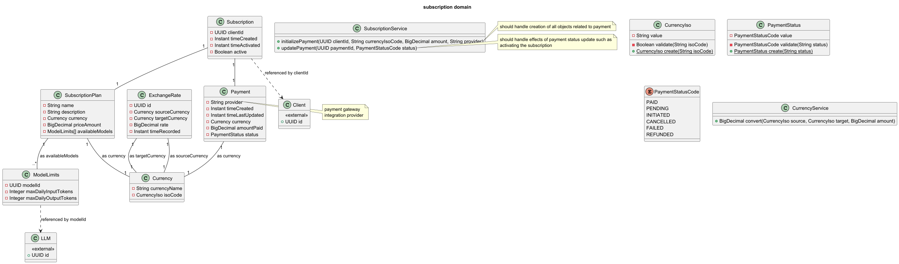

# Analysis and design

## Domain modelling

Domain identification
* chatbot – messaging, conversations, AI responses, user interactions.
* llm management – token tracking, model selection, enforcement of limits.
* subscriptions and billing – plans, payments, currencies, history.
* administration – analytics, user management, bulk messaging, promotions.

### Chatbot domain

- Entities: client, client preferences, conversation, message, media
- Value objects: phone number

* [puml file](uml/domain-modelling/chatbot-domain.puml)

### LLM management domain

- Entities: llm, client llm usage
- Value object: llm input output mode

* [puml file](uml/domain-modelling/llm-domain.puml)

### Subscription and billing

- Entities: subscription plan, subscription, payment, currency, model limits
- Value objects: currency iso

* [puml file](uml/domain-modelling/images/subscription_domain.png)

### Administration

- Entities: user, whatsapp template, campaign, message
- Value objects: campaign type, message status