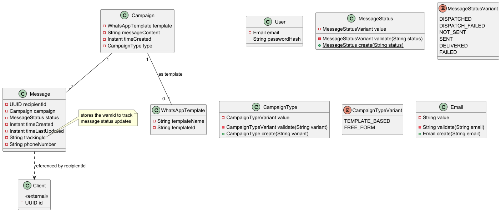

# Analysis and design

## Domain modelling

Domain identification
* chatbot – messaging, conversations, AI responses, user interactions.
* llm management – token tracking, model selection, enforcement of limits.
* subscriptions and billing – plans, payments, currencies, history.
* administration – analytics, user management, bulk messaging, promotions.

### Chatbot domain

#### Entities:
- client - info about the user
- client preferences - info about the state of any customisable options
- conversation - tracks conversations, conversation lasts 24 hours, deleted after 48 hours for privacy
- message - incoming and outgoing messages
- daily activity - tracks usage without sensitive data since conversations and messages will be deleted

#### Value objects:
- phone number
- message direction

* [chatbot puml file](uml/domain-modelling/chatbot-domain.puml)

### LLM management domain

#### Entities:
- llm - info for different llm models
- client llm usage
- daily model aggregate - track daily usage for each model

#### Value object
- llm input
- output mode
- image quality

* [llm-management puml file](uml/domain-modelling/llm-domain.puml)

### Subscription and billing domain

#### Entities:
- subscription plan
- subscription
- payment
- currency
- model limits

#### Value objects:
- currency iso

* [subscription puml file](uml/domain-modelling/images/subscription_domain.png)

### Administration domain

#### Entities:
- user - admin users
- whatsapp template - whatsapp templates for bulk messaging
- campaign - tracks status and performance of a bulk message
- message - tracks individual copies of bulk message sent to clients

#### Value objects:
- campaign type
- message status

* [administration puml file](uml/domain-modelling/administration_domain.puml)